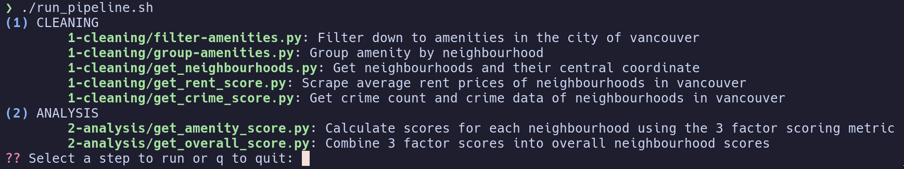

# CMPT 353 Project: Ranking Neighbourhoods in the City of Vancouver

## Required Libraries 

The required libraries are listed in the `requirements.txt` file.

## Execution Instructions

We've organized the commands into an interactive shell script. It only uses
the `printf` and `read` commands which should work on any \*nix environment.
It lists the pipeline steps as numbered options to run, and allows the user to 
enter the number to run the step.

```
./run_pipeline.sh
```



## Commands

The commands that are run by the pipeline are as follows

### (1) Cleaning Step

`1-cleaning/filter-amenities.py`: Filter down to amenities in the city of vancouver

```
python3 1-cleaning/filter-amenities.py 0-raw-data/amenities-lower-mainland.json.gz 0-working-data/amenities-vancouver.json
```

`1-cleaning/group-amenities.py`: Group amenity by neighbourhood

```
python3 1-cleaning/group-amenities.py 0-raw-data/neighbourhood-boundaries.geojson 0-working-data/amenities-vancouver.json 0-working-data/grouped-amenities.geojson
```

`1-cleaning/get_neighbourhoods.py`: Get neighbourhoods and their central coordinate

```
python3 1-cleaning/get_neighbourhoods.py 0-raw-data/neighbourhood-boundaries.csv 0-working-data/vancouver_neighbourhoods.csv
```

`1-cleaning/get_rent_score.py`: Scrape average rent prices of neighbourhoods in vancouver

```
python3 1-cleaning/get_rent_score.py 0-working-data/vancouver_rent_score.csv
```

`1-cleaning/get_crime_score.py`: Get crime count and crime data of neighbourhoods in vancouver

```
python3 1-cleaning/get_crime_score.py 0-raw-data/crimedata_csv_AllNeighbourhoods_2022.csv 0-working-data/vancouver_crime_data.csv 0-working-data/vancouver_crime_score.csv
```

### (2) Analysis Step

`2-analysis/get_amenity_score.py`: Calculate scores for each neighbourhood using the 3 factor scoring metric

```
python3 2-analysis/get_amenity_score.py 0-working-data/vancouver_neighbourhoods.csv 0-working-data/amenities-vancouver.json 0-working-data/amenities_by_neighbourhood.csv 0-working-data/amenities_scores.csv
```

`2-analysis/get_overall_score.py`: Combine 3 factor scores into overall neighbourhood scores

```
python3 2-analysis/get_overall_score.py 0-working-data/vancouver_rent_score.csv 0-working-data/vancouver_crime_score.csv 0-working-data/amenities_scores.csv 0-working-data/neighbourhood_scores.csv
```
